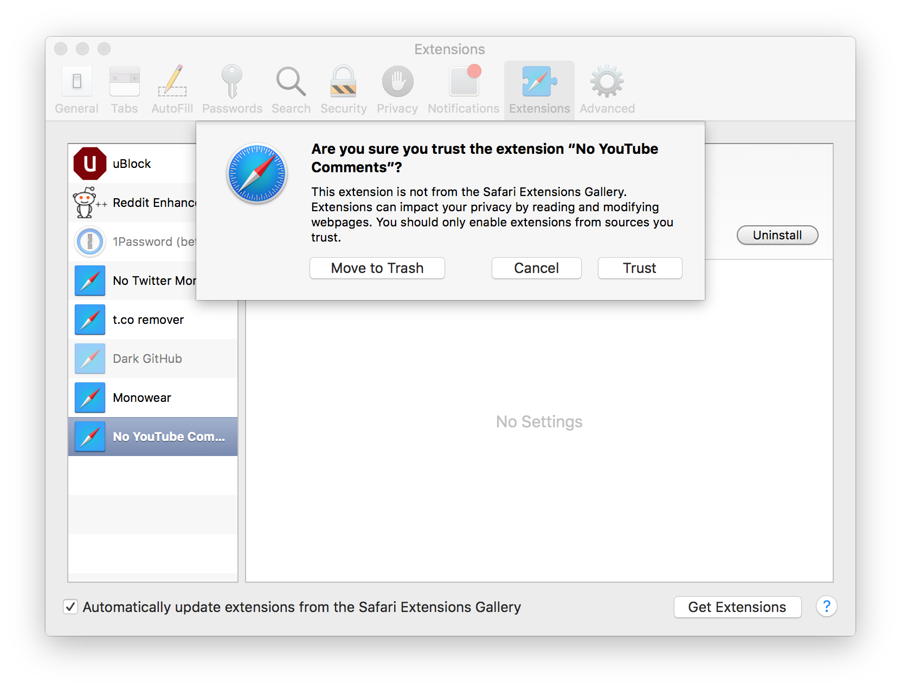
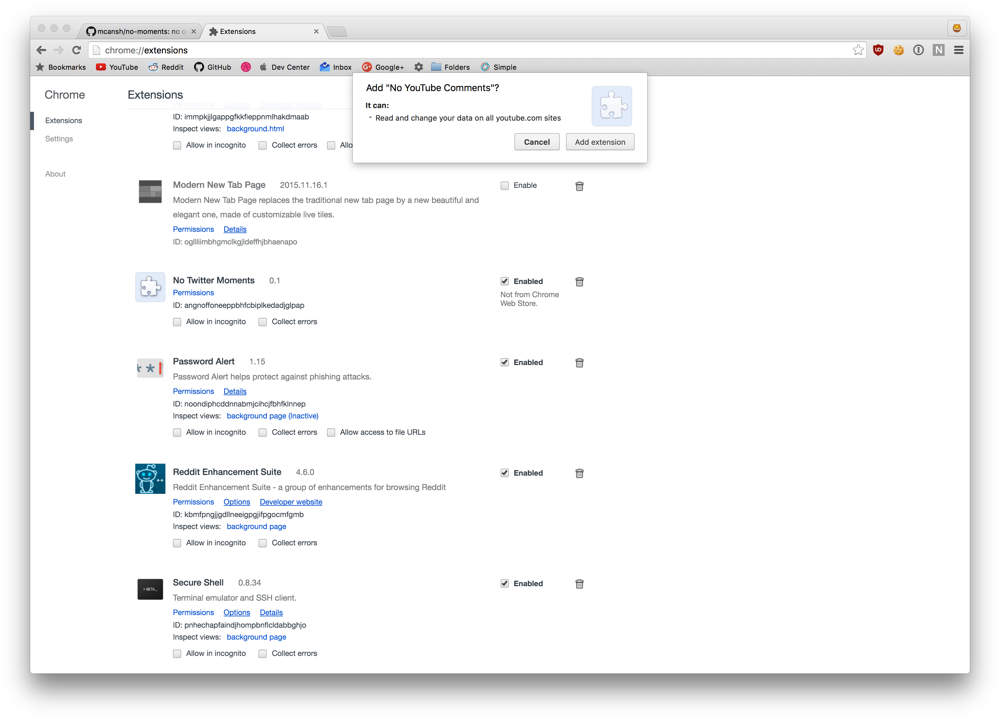

# no-youtube-comments

## Safari
Download the .safariextz and double click it, it will prompt you that it's not from the extension gallery, trust it anyway

## Chrome
Chrome only lets you use a sideloaded extension until you close and restart chrome, here is the extension on the

~~Drage the .crx on to the chrome://extensions page to install, it will prompt you if you want to add the extension~~
[webstore](https://chrome.google.com/webstore/detail/no-youtube-comments/ocicojjacjbckhaakapfbdkfecpegfdc)

